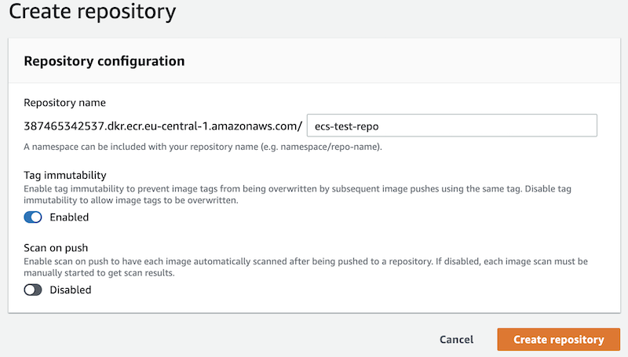
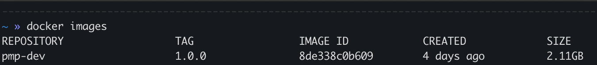
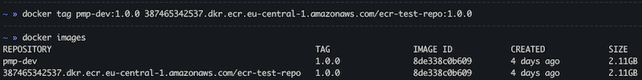
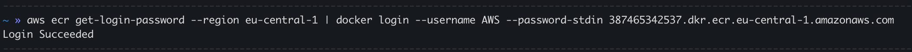
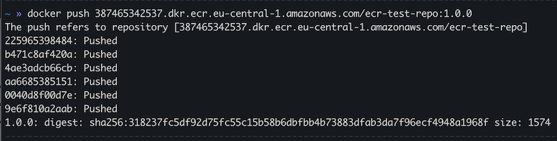
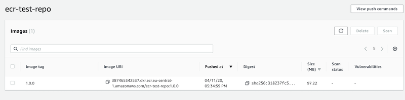
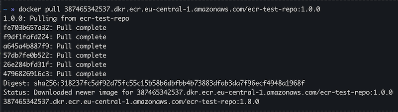
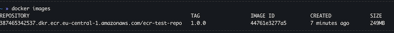

# Elastic Container Registry
### Amazon Elastic Container Registry (ECR) is a fully-managed Docker container registry like a DockerHub that makes it easy for developers to store, manage, and deploy Docker container images.

- Amazon ECR is integrated with Amazon Elastic Container Service (ECS), simplifying your development to production workflow.

- Amazon ECR eliminates the need to operate your own container repositories or worry about scaling the underlying infrastructure.

- Amazon ECR hosts your images in a highly available and scalable architecture, allowing you to reliably deploy containers for your applications. Integration with AWS Identity and Access Management (IAM) provides resource-level control of each repository.

<div style="text-align:center"></div>

<br>

# Let's create a ECR repository!

### To do this, just go to ECR reposiroty list and click `create repository`
<div style="text-align:center"></div>

After creation we will see your repo in ECR repository list with such URI: `387465342537.dkr.ecr.eu-central-1.amazonaws.com/ecr-test-repo`

<br>

# Push Docker image to ECR
Let's push our `pmp-dev` image to our ECR repository
<div style="text-align:center"></div>

### 1. Tag our images with our repository name
```bash
docker tag pmp-dev:1.0.0 387465342537.dkr.ecr.eu-central-1.amazonaws.com/ecr-test-repo:1.0.0
```
<div style="text-align:center"></div>

### 2. Login to ECR:
```bash
aws ecr get-login-password --region eu-central-1 | docker login --username AWS --password-stdin 387465342537.dkr.ecr.eu-central-1.amazonaws.com
```
<div style="text-align:center"></div>

### 3. Push the image
```bash
docker push 387465342537.dkr.ecr.eu-central-1.amazonaws.com/ecr-test-repo:1.0.0
```
<div style="text-align:center"></div>

#### And then we can go to our ECR repo page and see that our image has been successfully pushed: 
<div style="text-align:center"></div>

<br>

# Pull Docker image from ECR
To pull docker image from ECR:

### 1. Login to ECR:
```bash
aws ecr get-login-password --region eu-central-1 | docker login --username AWS --password-stdin 387465342537.dkr.ecr.eu-central-1.amazonaws.com
```
<div style="text-align:center"></div>

### 3. Pull the image
```bash
docker pull 387465342537.dkr.ecr.eu-central-1.amazonaws.com/ecr-test-repo:1.0.0
```
<div style="text-align:center"></div>
<div style="text-align:center"></div>