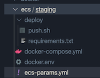

# ECS Deployment

# ECS deployment types:
## Rolling Update
#### The rolling update deployment type is controlled by Amazon ECS. This involves the service scheduler replacing the current running version of the container with the latest version. The number of tasks that Amazon ECS adds or removes from the service during a rolling update is controlled by the deployment configuration. A deployment configuration consists of the minimum and maximum number of tasks allowed during a service deployment.
<div style="text-align:center"></div>

## Blue/Green Deployment
#### The blue/green deployment type uses the blue/green deployment model controlled by CodeDeploy. This deployment type enables you to verify a new deployment of a service before sending production traffic to it.
<div style="text-align:center"></div>


<br>

# Deployment example:

### You can deploy your project using the ECS WEB UI, but if you need to deploy your project often, it will turn into routines and extra actions that can be automated with a simple script which you can see below:

`push.sh`
```bash
#!/bin/sh
set -e

# Export Rails master key to env
if [ ! -f ../../config/credentials/staging.key ]; then
  if [ -z "$RAILS_STAGING_KEY" ]; then
    echo "No rails master key"
    exit 1
  fi

  echo "$RAILS_STAGING_KEY" > ../../config/credentials/staging.key
fi

# Tag for Docker image tagging
export TAG=$(git log -1 --format=%h)

# ECS Cluster name
CLUSTER=project-name

# AWS Region
REGION=us-east-2

# ECS Service name
SERVICE=project-name-staging-backend

# AWS ECR Login
$(aws ecr get-login --no-include-email --region $REGION)

# Build Docker images
docker-compose build app web

# Upload to AWS ECR
docker-compose push app web

# Cofigure ECS Cluster
ecs-cli configure \
  --cluster $CLUSTER \
  --region $REGION \
  --default-launch-type EC2 \
  -config-name $CLUSTER

# Compose containers and deploy
ecs-cli compose \
  --project-name $SERVICE \
  service up \
  --cluster-config $CLUSTER \
  --force-deployment \
  --timeout 2 \
  --deployment-max-percent 100 \
  --deployment-min-healthy-percent 0
```
## In order to run this script, you need to have all the necessary components to configure, build and compose your ECS Cluster

- `push.sh` - Desploy script showed in previous slide
- `requirements.txt` - python pip requirements file
- `ecs_params.yml` - Task definition config
- `docker-compose.yml` - Docker compose file
- `docker.env` - docker conainter env variables (Optional)
## Also you must have created ECS Cluster and Service!
## Simply go to ecs directory and run `./deploy/push.sh`

# ECS deployment in CI/CD

### We wrote our automated ECS deploy script, but it still needs a human action such as run this command manually. This is useful when you want to verify your application build (do some manual stuff) before it will be deployed to production instance, but what if we want to add this deployment step to our CI/CD pipeline and forget about manual deployment?

## This is an example how we can do this by adding deploy job in our CircleCI config file:

```yml
  deploy:
    docker:
        # Python is needed for aws-cli and ecs-deploy packages installing
      - image: circleci/python:3.6.1
    environment:
      AWS_DEFAULT_OUTPUT: json
    steps:
      - checkout
      - setup_remote_docker:
          version: 18.06.0-ce
      - restore_cache:
          key: v1-{{ checksum "ecs/staging/deploy/requirements.txt" }}
      - run:
          name: Install the AWS CLI
          command: |
            python3 -m venv venv
            . venv/bin/activate
            pip install -r ecs/staging/deploy/requirements.txt
            curl -o ~/ecs-cli https://s3.amazonaws.com/amazon-ecs-cli/ecs-cli-linux-amd64-latest
            chmod +x ~/ecs-cli
      - save_cache:
          key: v1-{{ checksum "ecs/staging/deploy/requirements.txt" }}
          paths:
            - "venv"
      - run:
          name: Push image to ECR
          command: |
            export PATH=$HOME:$PATH
            . venv/bin/activate
            cd ecs/staging
            ./deploy/push.sh
```