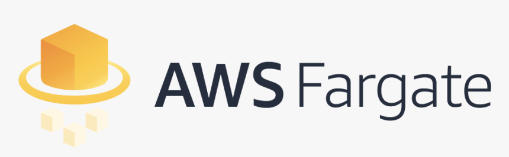

# ECS Fargate
###  AWS Fargate is a serverless compute engine for containers that works with both Amazon Elastic Container Service (ECS) and Amazon Elastic Kubernetes Service (EKS). Fargate makes it easy for you to focus on building your applications. Fargate removes the need to provision and manage servers, lets you specify and pay for resources per application, and improves security through application isolation by design.

### Procs:
- Fargate is Serverless (no EC2 to manage)
- Takes care of bin packing problem.
- Helps to focus on designing and building your applications instead of managing the infrastructure that runs them.
- Fargate containers are provisioned by the container spec (CPU / RAM)
- Fargate, as expected, makes the auto-scaling much easier. Here you simply need to define it at the task level, and you are good to go.

### Cons:
- Has long startup times
- No persistent filesystem access
- Pricing is based on the memory and CPU required to run a tasks, as well as the duration the task runs (by second and a minimum of 1 minute). If you launch complementary resources, like load balancers, you'll be charged for that as well.
