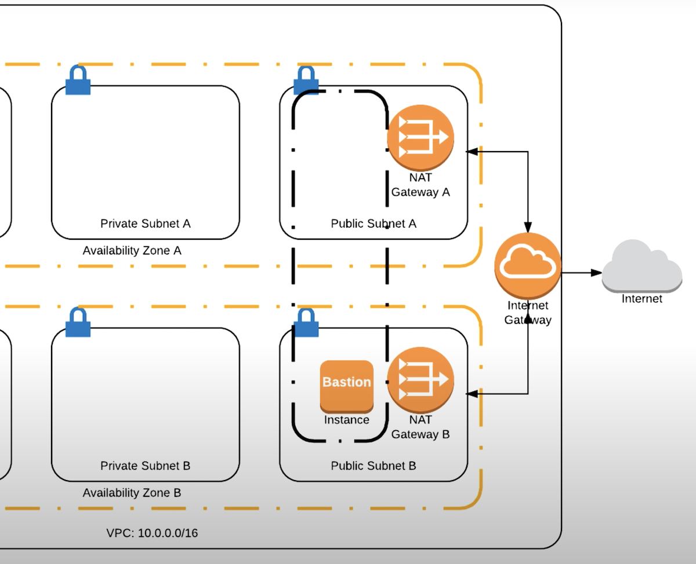
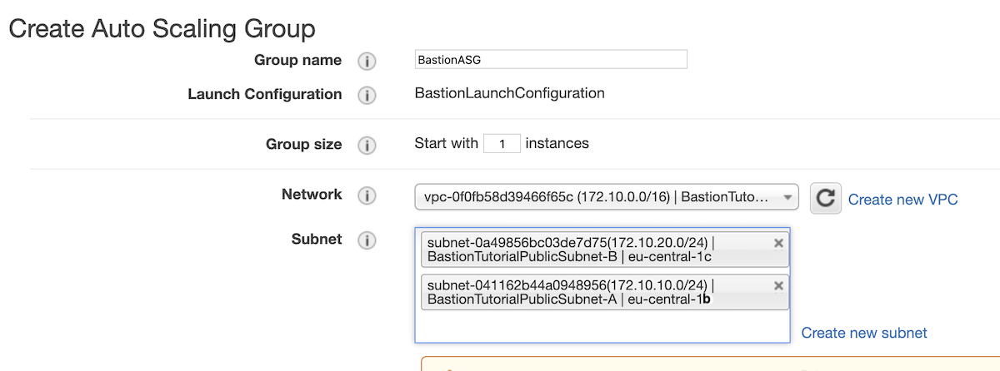
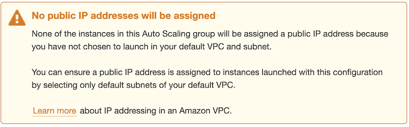

# Bastion HOST

## What is Bastion?
This is a jump host or jump box which used to access and manage instances in a separate security zone In our case it used for access to all private subnets in VPC using only one instance with SSH access.

# One ~~ring~~ instance to rule them all

## Let's imagine that we have VPC with one public and one private subnets in two AZs. We want to have access to private subnets via one secure jump box, so we need to launch Bastion Host in public subnet as shown in the picture:


## To achive that we must do several steps:
## 1. Create Security Group(SG) for our VPC with inbound rule for SSH connection


## 2. Create Auto Scaling Group(ASG) with new launch configuration. This will give us confidence that we won't lose access to our Bastion in case of failure of one of the data centers where our subnets are located. If data center in which our Bastion are localted will down then ASG automaticaly launch new Bastion instance in second AZ.

### To create a new launch configuration:
```yml
Go to `EC2 Service` -> `Auto Scaling Groups` -> `Create a new launch configuration`
~> Choose one of two `Amaxon linux AMI` 
-> Choose instance type
-> Enter name of ASG(You can skip other fiels and click `next`)
-> Choose storage
-> Choose early created Security Group with SSH access
-> Click `Review`
-> `Create launch configuration` and do not forget to select SSH key which we are going to use for Bastion connection
```
### And then we need to create ASG with our launch configuration and locate it in our VPC in public subnets A and B


## And that's it! We just created a Bastion Host instance with High Availability setup thanks to ASG.

## To connect to the Bastion Host, you just need to go to the EC2 instances, look at the public ip address of your instance and connect to it via SSH.

---
### And one more thing...

If you see this alert on ASG creation, you just need to go in VPC, find your public subnets and make sure that they have `Auto-assign public IPv4 address` enabled

